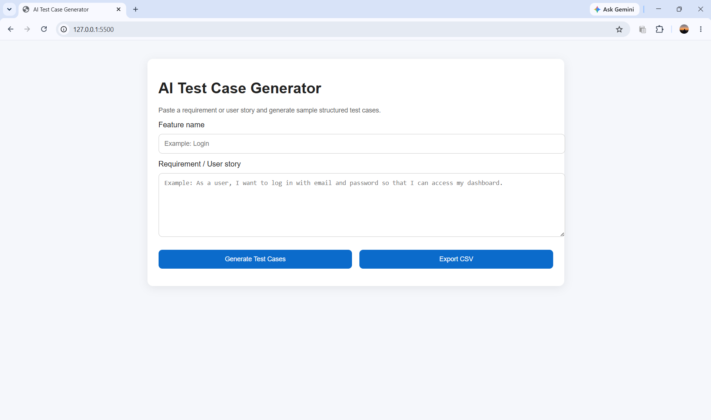
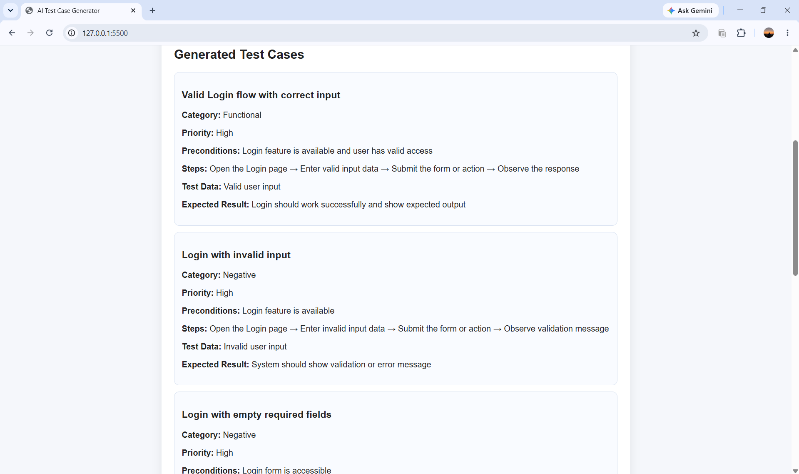
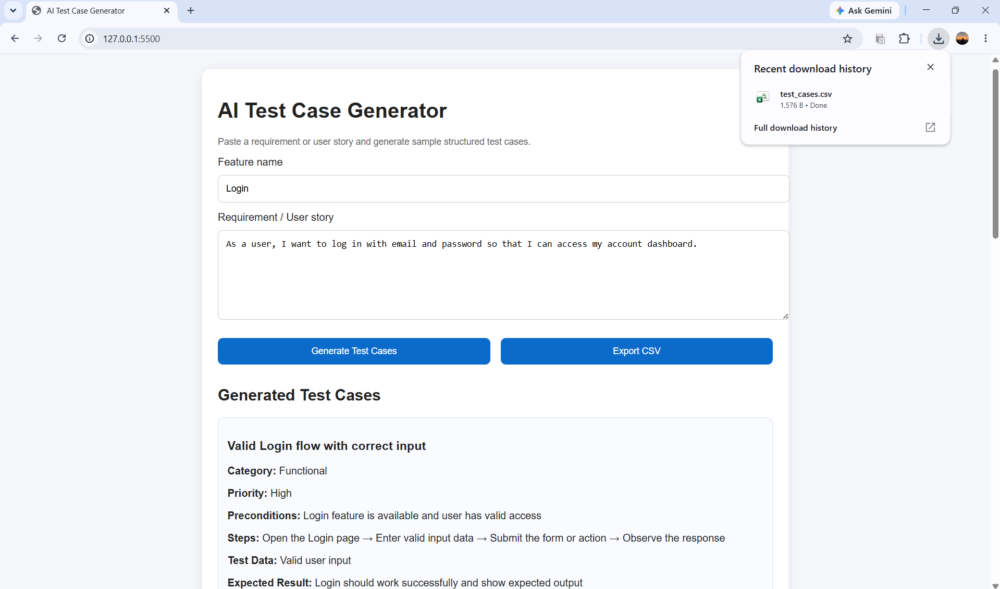

# AI Test Case Generator

AI-ready test case generator built with **FastAPI** and a clean frontend UI.  
It converts a feature name + requirement/user story into structured test cases and can export them to CSV, designed as a portfolio project for **AI automation testing** roles.

> Note: The backend supports OpenAI JSON-mode responses, but also includes a **local fallback generator** so the app works even when API quota or credits are not available.

---

## Features

- Generate structured test cases from a feature name and requirement/user story.
- Test case fields: title, category, priority, preconditions, steps, test data, expected result.
- CSV export of all generated test cases for documentation or import into test management tools.
- FastAPI backend with CORS-enabled API endpoints.
- Frontend single-page UI (vanilla HTML/CSS/JS) for quick manual use and demo.
- AI-ready design: integrates OpenAI Chat Completions with JSON mode, with safe local fallback.

---

## Tech Stack

- **Backend:** Python, FastAPI, Pydantic
- **Frontend:** HTML, CSS, JavaScript (vanilla)
- **AI Integration (optional):** OpenAI Chat Completions JSON mode
- **Other:** CSV generation, CORS middleware, Uvicorn

---

## Project Structure

```text
ai-test-case-generator/
│
├─ backend/
│  ├─ main.py           # FastAPI app + AI/local generator + CSV export
│  └─ requirements.txt  # Backend dependencies
│
├─ frontend/
│  ├─ index.html        # Single-page UI
│  ├─ styles.css        # Basic styling
│  ├─ script.js         # Calls backend /generate and /export-csv
│  └─ screenshots/
│     ├─ home.png
│     ├─ generated-output.png
│     └─ csv-export.png
│
└─ README.md
```

---

## How to Run (Backend)

1. Open a terminal and go to the backend folder:

   ```bash
   cd backend
   ```

2. Create and activate a virtual environment:

   ```bash
   python -m venv venv
   venv\Scripts\activate  # Windows
   # source venv/bin/activate  # Linux/Mac
   ```

3. Install dependencies:

   ```bash
   pip install -r requirements.txt
   ```

4. (Optional) Set your OpenAI API key as an environment variable:

   ```bash
   # Windows (PowerShell)
   setx OPENAI_API_KEY "sk-***************"

   # Windows (current session only)
   set OPENAI_API_KEY=sk-***************
   ```

   The backend will try OpenAI first and automatically fall back to local mock test cases if quota or connection fails.

5. Start the FastAPI server with Uvicorn:

   ```bash
   uvicorn main:app --reload
   ```

6. Check health and docs:

   - Health: [http://127.0.0.1:8000/health](http://127.0.0.1:8000/health)
   - API docs (Swagger UI): [http://127.0.0.1:8000/docs](http://127.0.0.1:8000/docs)

---

## How to Run (Frontend)

1. In another terminal, go to the frontend folder:

   ```bash
   cd frontend
   ```

2. Serve the static files with a simple HTTP server:

   ```bash
   python -m http.server 5500
   ```

3. Open the app in your browser:

   ```text
   http://127.0.0.1:5500
   ```

4. Usage:

   - Enter **Feature name** (e.g., `Login`).
   - Paste **Requirement / User story**.
   - Click **Generate Test Cases** to see structured test cases.
   - Click **Export CSV** to download a CSV file with all test cases.

---

## API Endpoints

- `GET /health`  
  Returns simple JSON status to verify the backend is running.

- `POST /generate`  
  Request body:

  ```json
  {
    "feature_name": "Login",
    "requirement_text": "As a user, I want to log in with email and password..."
  }
  ```

  Response body:

  ```json
  {
    "feature_name": "Login",
    "requirement_text": "...",
    "test_cases": [
      {
        "title": "Valid login with correct credentials",
        "category": "Functional",
        "priority": "High",
        "preconditions": "User account exists and is active",
        "steps": ["...", "..."],
        "test_data": "email=user@example.com; password=Valid@123",
        "expected_result": "User is redirected to dashboard"
      }
    ]
  }
  ```

- `POST /export-csv`  
  Same request body as `/generate`.  
  Response body (for frontend to handle):

  ```json
  {
    "filename": "test_cases.csv",
    "csv_content": "Title,Category,Priority,...\n..."
  }
  ```

---

## AI Integration vs Local Fallback

The backend uses this strategy:

1. **Try OpenAI (if `OPENAI_API_KEY` is set):**
   - Uses `chat.completions` with `response_format={"type": "json_object"}` to get strictly valid JSON output.
   - Parses the JSON into a list of test cases.

2. **If OpenAI fails (quota, network, etc.):**
   - Logs the error in the backend console.
   - Falls back to a deterministic **local generator** that returns 6 well-structured test cases based on the feature name and requirement.

This makes the project:
- Realistic for AI automation testing,
- But still fully demoable even for students without paid API access.

---

## Screenshots

### 1) Home screen


### 2) Generated test cases


### 3) CSV export


---

## Security Notes

- Do **not** commit your `OPENAI_API_KEY` to GitHub.
- Keep `.env` or environment variables local and ignored by Git.
- Revoke and recreate the API key if it was ever shared publicly.
- This repo is designed so that missing or invalid keys do not crash the app; it simply uses local test case generation instead.

---

## Possible Extensions

- Add Playwright tests that consume the generated CSV as data input.
- Add categories for API tests vs UI tests.
- Integrate with a test management tool or dashboard to visualize coverage.
- Add authentication to the backend if used in a real team environment.

---

## About this project

This project was built as part of an **AI automation testing portfolio** to demonstrate:

- Designing a small but realistic test case generation tool.
- Integrating an AI model for structured output (JSON mode).
- Handling failures gracefully with deterministic fallback logic.
- Providing exportable artifacts (CSV) for QA/test teams.